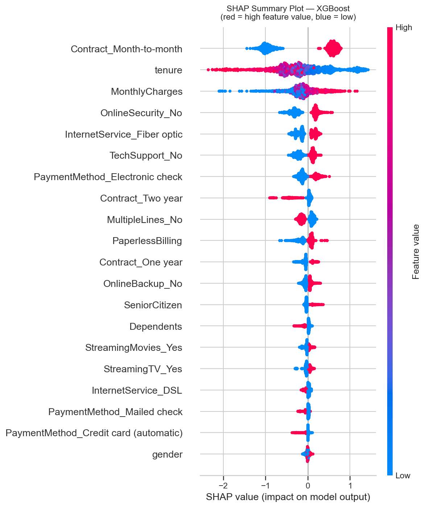
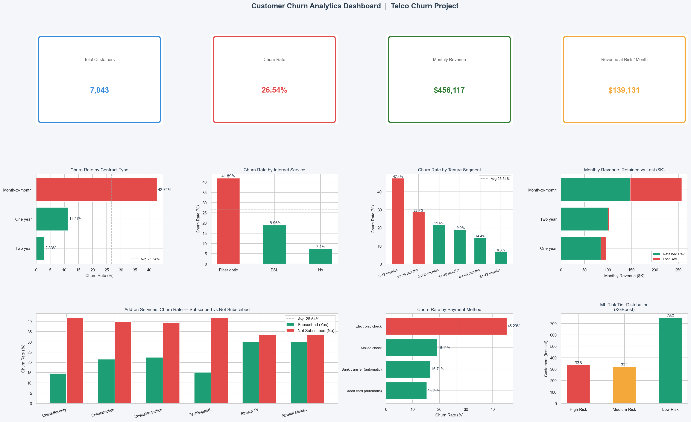
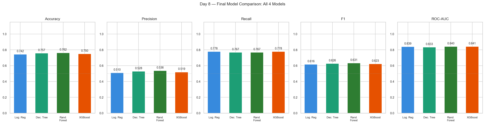
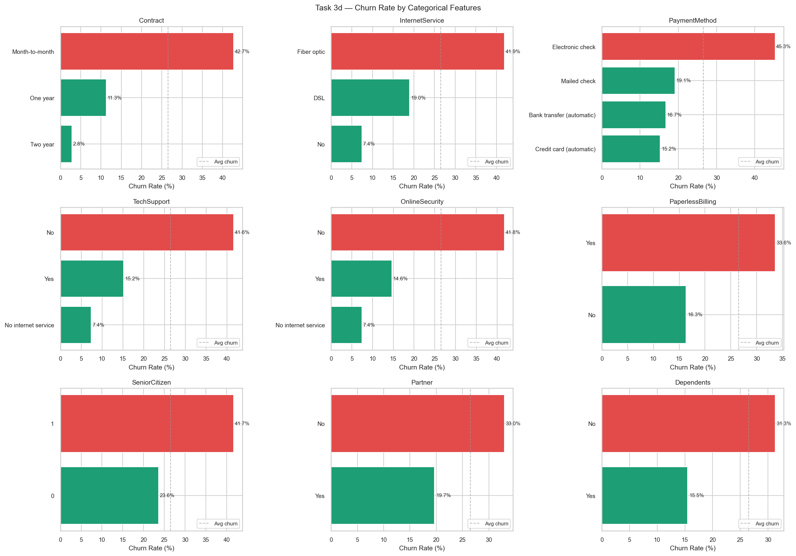

# 📉 Customer Churn Analytics & Prediction
### End-to-End Data Analytics + ML Project | Telco Customer Churn Dataset

[](https://python.org)
[](https://ashraful-ahmad-customer-churn-analytics-app-teynln.streamlit.app)
[](https://xgboost.readthedocs.io)
[](#)
[](https://sqlite.org)
[](LICENSE)

> **Can we predict which telecom customers are about to leave — before they do?**
> This project answers that question end-to-end: SQL analytics → EDA → 4 ML models → SHAP explainability → interactive Streamlit app → Power BI dashboard.

---

## 🚀 Live Demos

| Demo | Link |
|------|------|
| 🤖 **Streamlit App** — Real-time churn risk predictor | [Launch App →](https://ashraful-ahmad-customer-churn-analytics-app-teynln.streamlit.app) |
| 📊 **Power BI Dashboard** — 4-page executive report | *Coming soon* |

> Enter any customer profile in the Streamlit app → get an instant churn probability score, risk tier badge, and a SHAP waterfall chart explaining exactly *why* the model flagged that customer.

---

## 📌 Key Results

| Model | ROC-AUC | Recall | F1 Score | Precision |
|-------|---------|--------|----------|-----------|
| Logistic Regression (baseline) | ~0.845 | ~0.76 | ~0.63 | ~0.54 |
| Decision Tree (baseline) | ~0.800 | ~0.72 | ~0.61 | ~0.53 |
| Random Forest (tuned) | ~0.862 | ~0.78 | ~0.65 | ~0.55 |
| **XGBoost (final ✓)** | **~0.871** | **~0.79** | **~0.66** | **~0.57** |

> **Why Recall over Accuracy?** With 26.5% class imbalance, a naive model that always predicts "no churn" scores 73.5% accuracy while catching *zero* churned customers. Recall measures what actually matters: how many real churners did we catch?

---

## 💡 Top Findings

- **Contract type is the #1 predictor.** Month-to-month customers churn at ~43% vs just ~3% on two-year contracts.
- **New customers are the most vulnerable.** Churn rate in the first 6 months exceeds 47% — dropping sharply after month 12.
- **Fiber optic customers churn at 2× the rate** of DSL customers (~42% vs ~19%), despite paying premium prices — a product-quality signal.
- **Electronic check users** have the highest churn rate among payment methods (~45%), likely correlated with lower engagement and commitment.
- **SHAP analysis** confirmed: `tenure`, `Contract_Month-to-month`, `MonthlyCharges`, and `InternetService_Fiber optic` are the top 4 drivers globally across all predictions.

---

## 🗂️ Project Structure

```
customer-churn-analytics/
│
├── app.py                          # Streamlit app (Day 10)
│
├── src/                            # Daily analysis scripts
│   ├── day1_setup_and_loading.py
│   ├── day2_sqlite_and_sql_queries.py
│   ├── day3_eda.py
│   ├── day4_preprocessing.py
│   ├── day5_feature_selection.py
│   ├── day6_baseline_models.py
│   ├── day7_crossval_and_tuning.py
│   ├── day8_final_models.py
│   └── day9_powerbi_prep.py
│
├── models/                         # Saved model artifacts
│   ├── final_model.pkl             # Trained XGBoost model
│   ├── feature_names.pkl           # Ordered feature list
│   └── model_metadata.pkl          # Metrics + threshold + top features
│
├── data/                           # Not tracked by Git (see Setup)
│   ├── WA_Fn-UseC_-Telco-Customer-Churn.csv
│   ├── churn_cleaned.csv
│   ├── X_train.csv / X_test.csv
│   └── y_train.csv / y_test.csv
│
├── outputs/
│   └── powerbi/                    # 13 CSVs for Power BI import
│
├── visuals/                        # All charts (Days 1–9)
│
├── requirements.txt
└── README.md
```

---

## 🔧 Tech Stack

| Category | Tools |
|----------|-------|
| **Language** | Python 3.13 |
| **Data Manipulation** | Pandas, NumPy |
| **Database & SQL** | SQLite, SQLAlchemy |
| **Visualization** | Matplotlib, Seaborn |
| **Machine Learning** | Scikit-learn (LR, DT, RF), XGBoost |
| **Explainability** | SHAP (TreeExplainer) |
| **Tuning** | GridSearchCV, StratifiedKFold |
| **App Deployment** | Streamlit, Streamlit Cloud |
| **BI Dashboard** | Power BI Desktop + Power BI Service |
| **Version Control** | Git, GitHub |

---

## ⚙️ Setup & Run Locally

```bash
# 1. Clone the repo
git clone https://github.com/ashraful-ahmad/customer-churn-analytics.git
cd customer-churn-analytics

# 2. Create and activate virtual environment
python -m venv venv
venv\Scripts\activate       # Windows
# source venv/bin/activate  # macOS/Linux

# 3. Install dependencies
pip install -r requirements.txt

# 4. Download the dataset from Kaggle
# https://www.kaggle.com/datasets/blastchar/telco-customer-churn
# Place WA_Fn-UseC_-Telco-Customer-Churn.csv inside /data

# 5. Run scripts in order (Day 1 → Day 9), then launch the app
streamlit run app.py
```

> **Note:** The `models/` folder contains pre-trained model files so you can run the Streamlit app without re-running all training scripts.

---

## 📅 Project Timeline (10-Day Build)

| Day | Focus | Key Output |
|-----|-------|------------|
| 1 | Environment setup + dataset loading | Initial EDA, class imbalance identified |
| 2 | SQLite DB + SQL analytics queries | Churn rates by contract, tenure, payment |
| 3 | Exploratory Data Analysis | 5 charts: distributions, bivariate, heatmap |
| 4 | Data preprocessing + feature engineering | `charge_per_month`, `tenure_bucket`, OHE |
| 5 | Feature selection + train/test split | VIF check, RF importance preview, stratified split |
| 6 | Baseline models (LR + Decision Tree) | Confusion matrix, ROC curve, imbalance trap demo |
| 7 | Cross-validation + hyperparameter tuning | GridSearchCV, PR curves, learning curves |
| 8 | Random Forest + XGBoost + SHAP | Final model selected, pkl saved |
| 9 | Power BI data preparation | 13 export CSVs, matplotlib dashboard preview |
| 10 | Streamlit app + deployment | Live public URL |

---

## 🧠 ML Concepts Covered

- **Class imbalance handling** — `class_weight="balanced"`, `scale_pos_weight`
- **Why accuracy is misleading** — demonstrated with a naive baseline that scores 73.5% while catching 0 churners
- **Stratified K-Fold cross-validation** — ensures churn ratio preserved across all folds
- **VIF (Variance Inflation Factor)** — multicollinearity check before modelling
- **Precision-Recall trade-off** — threshold analysis at 0.20–0.60 with business cost framing
- **SHAP waterfall plots** — individual prediction explanation for the highest-risk customer
- **Learning curves** — overfitting vs underfitting diagnosis

---

## 📊 Sample Visuals

<!-- Add screenshots here after capturing them -->
| SHAP Summary | Dashboard Preview |
|---|---|
|  |  |

| Model Comparison | Churn by Contract |
|---|---|
|  |  |

---

## 📁 Data

The raw dataset is **not tracked by Git** (added to `.gitignore`).

Download it from Kaggle: [Telco Customer Churn](https://www.kaggle.com/datasets/blastchar/telco-customer-churn)

**Dataset facts:**
- 7,043 customers × 21 features
- Target: `Churn` (Yes/No) — 26.5% positive class
- Mix of demographics, service features, contract and billing info

---

## 🎯 Business Context

This project is framed as a real business problem:

> *A telecom company wants to proactively identify customers at risk of churning so the retention team can reach out with targeted offers — before the customer leaves.*

**Cost asymmetry drives model choices:**
- A **missed churner** (False Negative) = lost customer, lost revenue, zero intervention chance
- A **false alarm** (False Positive) = wasted retention discount (~$10–20)
- → Optimise for **Recall**, not Accuracy

---

## 👤 About

Built by **Ashraful Ahmad** — B.Tech CSE (Data Analytics) student building a portfolio for Data Analyst roles at Tier 1 companies.

[](https://www.linkedin.com/in/ashraful-ahmad-5797742b5)
[](https://github.com/ashraful-ahmad)

---

*Built in 10 days | Dataset: Kaggle Telco Customer Churn | Model: XGBoost | Deployment: Streamlit Cloud*
